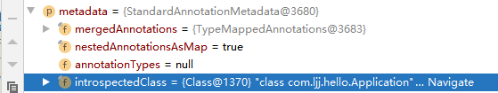
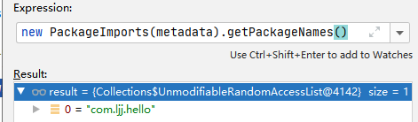

# 主程序类，主入口类

```java
import org.springframework.boot.SpringApplication;
import org.springframework.boot.autoconfigure.SpringBootApplication;

/**
 * @SpringBootApplication来标注一个主程序类，说明这是一个springBoot应用，SpringBoot就运行这个类的main方法来启动SpringBoot应用。
 * 这个标签相当于：
 * @SpringBootConfiguration
 * @EnableAutoConfiguration
 * @ComponentScan
 * 三个配置
 */
@SpringBootApplication
public class Application {

    public static void main(String[] args) {
        //springBoot应用启动
        SpringApplication.run(Application.class, args);
    }

}
```

打开@SpringBootApplication发现他是组合注解，组合了以下三个注解：

* @SpringBootConfiguration

 * @EnableAutoConfiguration

 * @ComponentScan

   

   下面一个一个看：

   1.  **@SpringBootConfiguration（SpringBoot配置类）：**

   ​			标注在某个类上，表示这是一个Spring Boot的配置类，打开它：

   ```java
   @Target({ElementType.TYPE})//说明@SpringBootConfiguration只能在类上用
   @Retention(RetentionPolicy.RUNTIME)//可以保留到运行阶段
   @Documented//描述注解是否被抽取到api文档中
   @Configuration
   public @interface SpringBootConfiguration {
       @AliasFor(
           annotation = Configuration.class
       )
       boolean proxyBeanMethods() default true;
   }
   ```

   ​			它又由@Configuration组成：

   ​					@Configuration：spring本身的注解，作用是指定当前类是一个配置类

   丧心病狂打开@Configuration：

   ```java
   @Target({ElementType.TYPE})
   @Retention(RetentionPolicy.RUNTIME)
   @Documented
   @Component
   public @interface Configuration {
       @AliasFor(
           annotation = Component.class
       )
       String value() default "";
   
       boolean proxyBeanMethods() default true;
   }
   ```

   ​                 @Component：声明当前类是个spring组件的标签呀（衍生出@Service、@Controller、@ Repository那个）

   ```
   Component:
             作用：用于把当前类对象存入spring容器中
             属性：
                 value：用于指定bean的id。当我们不写时，它的默认值是当前类名，且首字母改小写。
         Controller：一般用在表现层
         Service：一般用在业务层
         Repository：一般用在持久层
         以上三个注解他们的作用和属性与Component是一模一样。
         他们三个是spring框架为我们提供明确的三层使用的注解，使我们的三层对象更加清晰
   ```

好，这就清晰了，@SpringBootConfiguration就是指定当前类是一个配置类，只是它是由springboot声明的，作用和spring的@Configuration一样，也是会被放进IoC容器滴。

2. **@EnableAutoConfiguration**：开启自动配置功能

   点开它的源码来看：

   ```java
   @Target(ElementType.TYPE)//说明这个标签只能放在类上
   @Retention(RetentionPolicy.RUNTIME)//可以保留到运行阶段
   @Documented
   @Inherited//加上这个元注解，那@EnableAutoConfiguration就可以被加它的类的子类所继承
   @AutoConfigurationPackage
   @Import(AutoConfigurationImportSelector.class)//将此配置类导入spring容器中
   public @interface EnableAutoConfiguration {
       
   }
   ```

   发现它是由@AutoConfigurationPackage和@Import(AutoConfigurationImportSelector.class)组成的。

   @Import：导入其它配置类，将其他配置类的类对象传入@Import中，spring就会在加载当前被标签标注的类进IoC容器时，将这个类作为当前被标签标注类的子配置类一起加载到容器中去。

   首先看**@AutoConfigurationPackage**

   ```java
   @Target(ElementType.TYPE)
   @Retention(RetentionPolicy.RUNTIME)
   @Documented
   @Inherited
   @Import(AutoConfigurationPackages.Registrar.class)
   public @interface AutoConfigurationPackage {}
   ```

   发现这玩意也是个Import，Impor了个AutoConfigurationPackages.Registrar配置类，进去研究它：

   Registrar是个内部类，主要是registerBeanDefinitions方法

   ```java
   static class Registrar implements ImportBeanDefinitionRegistrar, DeterminableImports {
      /*
      注册一些bean定义信息，通过这个方法给spring容器中自动导入bean
      */
      @Override
      public void registerBeanDefinitions(AnnotationMetadata metadata, BeanDefinitionRegistry registry) {
          //重点是metadata：它是这个注解的元信息
         register(registry, new PackageImports(metadata).getPackageNames().toArray(new String[0]));
      }
   
      @Override
      public Set<Object> determineImports(AnnotationMetadata metadata) {
         return Collections.singleton(new PackageImports(metadata));
      }
   
   }
   ```

   metadata是当前注解的元信息，记录了当前注解的一些信息，从下图可以看出，他记录了这个注解标注在com.ljj.hello.Application类上面

   

   用它的getPackageNames()方法就能拿到被标注类的包名。

   

   ​		到这里就明白了，**@AutoConfigurationPackage**就是将此注解所标注的类所在的包及其子包中的所有组件扫描到容器之中，由于**@AutoConfigurationPackage**是@SpringBootConfiguration的元注解的元注解，就相当于他就标注在@SpringBootConfiguration标注的地方，也就是主程序类。

   # **有了这个标签，springBoot就帮我们把自己写的组件加入容器中，免于自己写配置文件或者扫描了**

   

   然后再来看看**@EnableAutoConfiguration**中的另一个标签：

   @Import(AutoConfigurationImportSelector.class)

   AutoConfigurationImportSelector：导入哪些组件的选择器

   用来将各个模块所需要的组件加载到spring容器中去。


# **有了这个标签，springBoot就帮我们把集成的模块所需要的组件都加载到spring容器中去，不用我们集成新框架或者模块时自己写一大堆配置文件了**