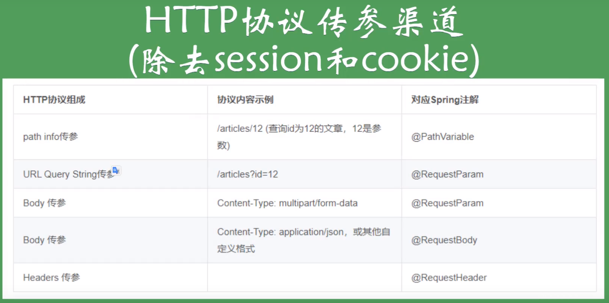
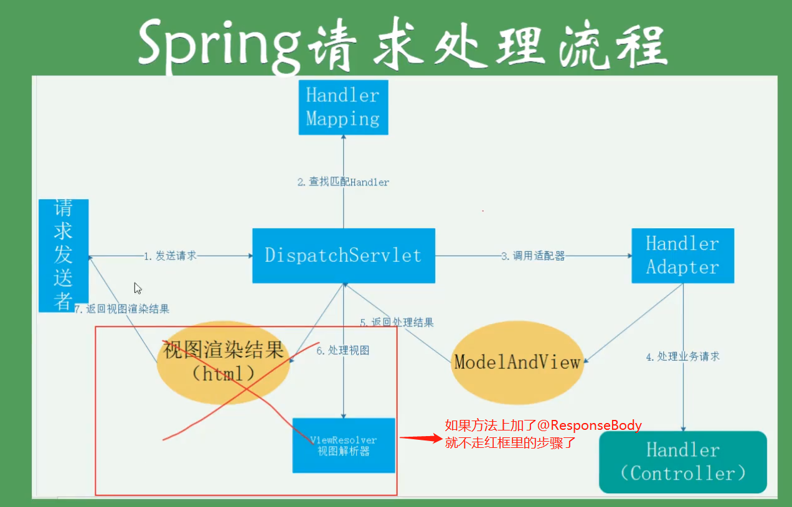

# 后台接收参数的标签使用方法

@PathVariable 从路径（指url）中获取参数
@RequestBody 从请求体中获取参数(可以接受嵌套数据)
@RequestParam 接收表单数据,或者是url中问号后的数据（不可接收嵌套数据）
@RequestHeader 接收请求头里的数据

@ResponseBody 加上这个标签这个方法的返回值就会以json格式返回给前台，如果不加，就会使用返回值去view找相应的前端页面去了

可以将@RequestBody 和@ResponseBody理解为反序列化和序列化的过程，都是经过处理从body中将json转化成javaBean的操作

