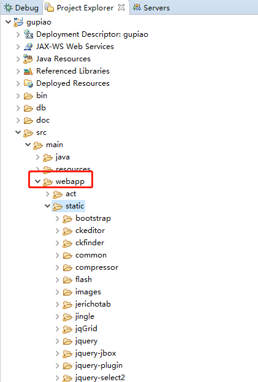
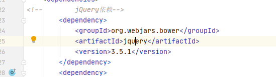
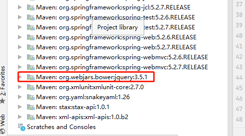
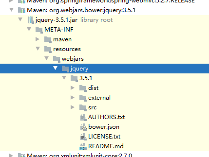
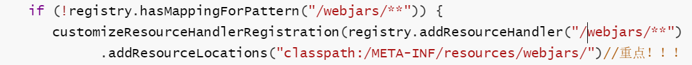
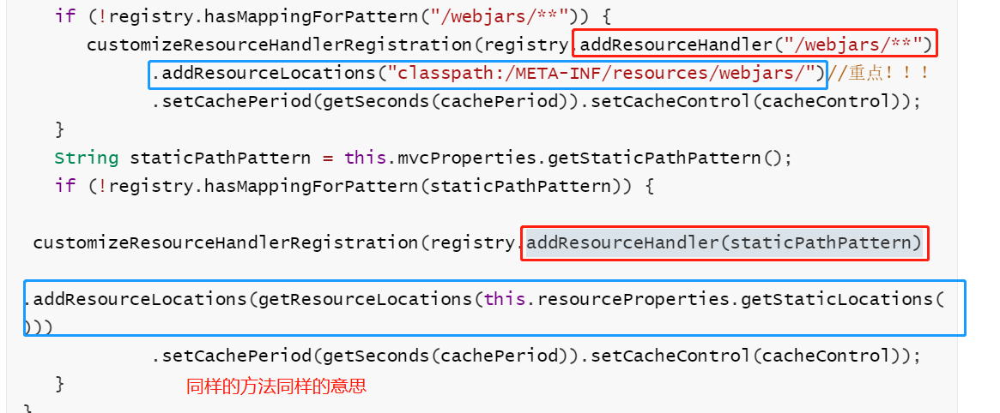

# 静态资源的访问

### 1.jar包形式

就是一些jar包形式的前端框架的引入(jQuery,bootstrap等)

以前都是在根路径webapps下放着



而springBoot是在classpath:/META-INF/resources/webjars/下放这些东西。

**webjars:以jar包的方式引入静态资源**


1. 引入方式：用maven的方式去引入，可以去http://www.webjars.org/上面去找它的maven依赖

   

   引入之后去External Libraries看下：

   

   打开它看看结构：

   

   确实是/META-INF/resources/webjars/**

2. 访问方法：/webjars/**

   例如上边的例子想访问jquery.js，就可以通过http://localhost:8080/webjars/jquery/3.5.1/src/jquery.js来访问到啦。
   
   **题外话：**
   由于你在前端文件经常引用http://localhost:8080/webjars/jquery/3.5.1/src/jquery.js来访问，这样一来有个问题，你如果说升级了jquery版本，那岂不是页面都要改路径。所以，访问路径隐去版本号就很有必要了：
   
   添加这个依赖：
   ```xml
        <dependency>
            <groupId>org.webjars</groupId>
            <artifactId>webjars-locator</artifactId>
            <version>0.40</version>
        </dependency>
   ```
   
   然后路径只写http://localhost:8080/webjars/jquery/src/jquery.js就好了
```
3. 自动配置原理：

   /webjars/** 就能访问 /META-INF/resources/webjars/**，但是为什么呢？当然是自动配置的功劳啦

   下面研究一下：

   首先，自动配置有两个关键的类：

   -  ***AutoConfiguration.java    帮我们给容器中自动导入组件
   -  ***Properties.java                   配置类来封装配置文件的内容（默认配置都在里面）

   找到负责做url映射的配置，也就是WebMvc，去WebMvcAutoConfiguration看看这个方法：

   ```java
   @Override
   //添加资源映射
   public void addResourceHandlers(ResourceHandlerRegistry registry) {
      if (!this.resourceProperties.isAddMappings()) {
         logger.debug("Default resource handling disabled");
         return;
      }
      Duration cachePeriod = this.resourceProperties.getCache().getPeriod();
      CacheControl cacheControl = this.resourceProperties.getCache().getCachecontrol().toHttpCacheControl();
      if (!registry.hasMappingForPattern("/webjars/**")) {
         customizeResourceHandlerRegistration(registry.addResourceHandler("/webjars/**")
               .addResourceLocations("classpath:/META-INF/resources/webjars/")//重点！！！
               .setCachePeriod(getSeconds(cachePeriod)).setCacheControl(cacheControl));
      }
      String staticPathPattern = this.mvcProperties.getStaticPathPattern();
      if (!registry.hasMappingForPattern(staticPathPattern)) {
         customizeResourceHandlerRegistration(registry.addResourceHandler(staticPathPattern)
               .addResourceLocations(getResourceLocations(this.resourceProperties.getStaticLocations()))
               .setCachePeriod(getSeconds(cachePeriod)).setCacheControl(cacheControl));
      }
   }
```

   注意这一段：

   

   意思就是：/webjars/** 下的所有请求，都去 classpath:/META-INF/resources/webjars/**下找资源。

### 2.自己写的资源的引入

WebMvcAutoConfiguration中刚才分析的这个方法，下面部分就是引入自己的资源的映射，看下图：



和上面一摸一样，staticPathPattern 下的所有请求，都去this.resourceProperties.getStaticLocations()下找资源。

staticPathPattern点进去发现它等于"/**"

getStaticLocations点进去发现它等于

```java
private static final String[] CLASSPATH_RESOURCE_LOCATIONS = { "classpath:/META-INF/resources/",
      "classpath:/resources/", "classpath:/static/", "classpath:/public/" };
```

翻译翻译，就是说所有的请求过来，都会在以上四个地方去找资源

### 3.欢迎页

被”/**“映射，可直接访问静态资源文件夹下的所有index.html页面

直接localhost:8080就行了

