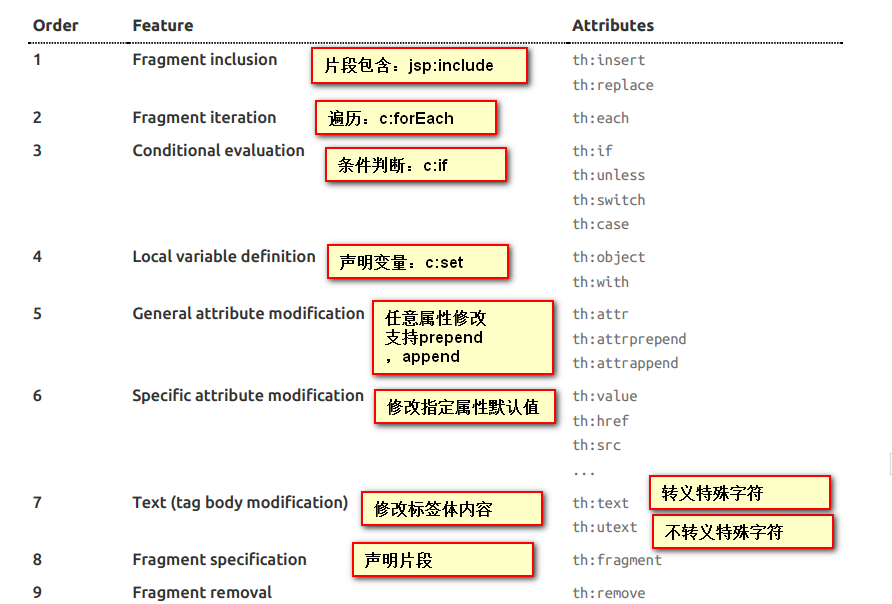

#thymeleaf
###1.引入

```xml
<properties>
        <thymeleaf.version>3.0.11.RELEASE</thymeleaf.version>
        <thymeleaf-layout-dialect.version>2.1.1</thymeleaf-layout-dialect.version>
    </properties>
<!--        thymeleaf依赖-->
        <dependency>
            <groupId>org.springframework.boot</groupId>
            <artifactId>spring-boot-starter-thymeleaf</artifactId>
        </dependency>

```
###2.默认规则
```java
@ConfigurationProperties(prefix = "spring.thymeleaf")
public class ThymeleafProperties {

	private static final Charset DEFAULT_ENCODING = StandardCharsets.UTF_8;

	public static final String DEFAULT_PREFIX = "classpath:/templates/";//默认前缀

	public static final String DEFAULT_SUFFIX = ".html";//默认后缀
}
```
只要把html文件放在classpath:/templates/路径下，就可以直接访问了
###3.语法

1）属性

​		th:text						修改标签体的内容

​		th:utext					  不转义特殊字符

​		th:任意html属性		修改这个属性


例如：
```html
<p style="color: red" th:text="${msg}" th:if="${not #strings.isEmpty(msg)}"></p>
<!--只有th:if=后面的值为真的时候，这个标签才显示-->
```
###4.抽取公共代码(th:fragment)

```html
1、抽取公共片段
<div th:fragment="copy">
&copy; 2011 The Good Thymes Virtual Grocery
</div>

2、引入公共片段
<div th:insert="~{footer :: copy}"></div>
~{templatename::#selector}：模板名::选择器
~{templatename::fragmentname}:模板名::片段名
footer其实就是一个页面的名称
selector就是这个要公用标签的id，引用的时候记得加#
copy就是要这个要公用的代码段的th:fragment="copy"属性声明出来的
```

