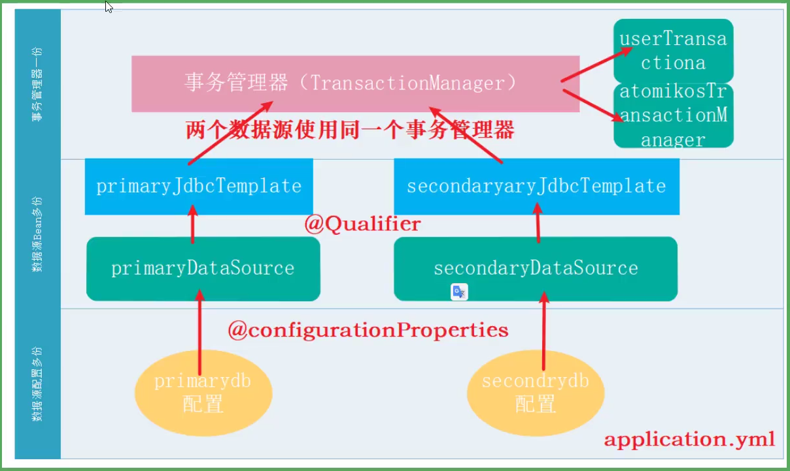
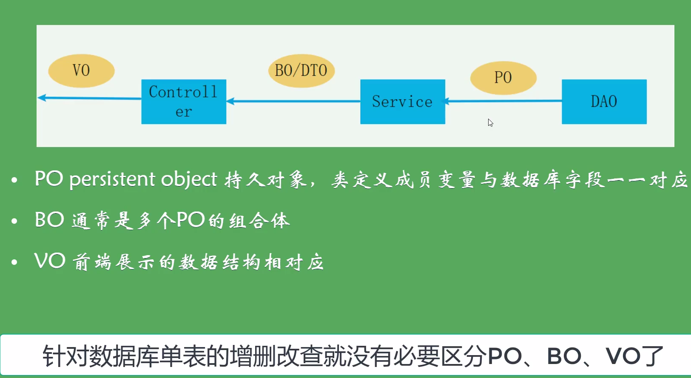
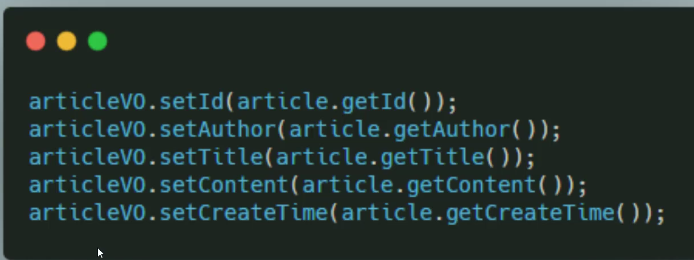
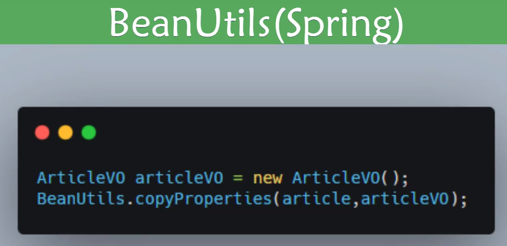
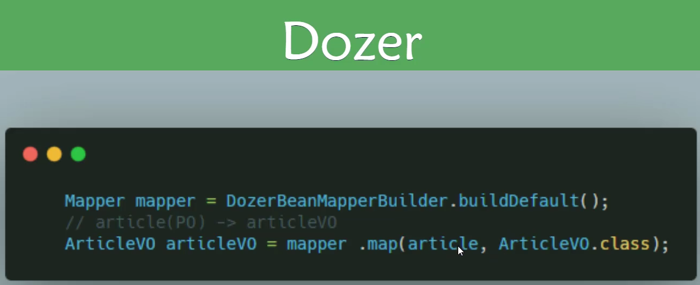

**适用于 04_SB_Jdbc；**

### 1.spring JDBC引入依赖

```xml
        <dependency>
            <groupId>org.springframework.boot</groupId>
            <artifactId>spring-boot-starter-jdbc</artifactId>
        </dependency>
        <dependency>
            <groupId>mysql</groupId>
            <artifactId>mysql-connector-java</artifactId>
            <scope>runtime</scope>
        </dependency>        

```
### 2.配置数据源信息

```yaml
spring:
  datasource:
    url: jdbc:mysql://localhost:3306/test?useUnicode=true&characterEncoding=utf8&&useSSL=true&serverTimezone=UTC
    username: root
    password: 123456
    driver-class-name: com.mysql.cj.jdbc.Driver
```
注意：


### 3.多数据源的配置

```yaml
spring:
  datasource:
    #自定义数据源的话就要写jdbc-url:，而不是url：
    one:
      jdbc-url: jdbc:mysql://localhost:3306/test?useUnicode=true&characterEncoding=utf8&&useSSL=true&serverTimezone=UTC
      username: root
      password: 123456
      driver-class-name: com.mysql.cj.jdbc.Driver
    two:
      jdbc-url: jdbc:mysql://localhost:3306/test2?useUnicode=true&characterEncoding=utf8&&useSSL=true&serverTimezone=UTC
      username: root
      password: 123456
      driver-class-name: com.mysql.cj.jdbc.Driver
```

再整个配置类：

```java
package com.ljj.springboot.tools;

import com.ljj.springboot.domain.Reader;
import org.springframework.beans.factory.annotation.Qualifier;
import org.springframework.boot.context.properties.ConfigurationProperties;
import org.springframework.boot.jdbc.DataSourceBuilder;
import org.springframework.context.annotation.Bean;
import org.springframework.context.annotation.Configuration;
import org.springframework.context.annotation.Primary;
import org.springframework.jdbc.core.JdbcTemplate;

import javax.sql.DataSource;

/**
 * @Primary 如果容器有多个同类型的bean，autowired会优先选择带@Primary标签的bean
 * @ConfigurationProperties(prefix = "spring.datasource.one")两种用法：
 *      1.用再类上，直接给成员变量赋值
 *      2.用在方法上，给方法的返回值赋值
 *
 * spring知识回顾：
 *      当使用注解配置的方式时（@Configuration），如果这个方法有参数，spring容器会自动去容器中找有没有可用的这个形参的bean对象。
 *      查找的方式和Autowired一样：
 *          自动按照类型注入，没有同类型报错；有唯一的则成功；有多个则用被它修饰的变量名去匹配bean的名称，有则成功，没有报错
 *
 *       @Qualifier  1.用在成员变量上时，必须和@Autowired一起用，在@Autowired找到的范围中（同类型），再用@Qualifier（“beanName”）去匹配，
 *                   这种情况下，@Qualifier+@Autowired=@Resource;
 *                   2.用在形参上时，那就是在@Configuration中用呀，人家自动按@Autowired方式给你找，所以看似单独用，其实还是一起用的效果啦
 *
 *
 */
@Configuration
public class DataSourceConfig {
    @Primary
    @Bean
    @ConfigurationProperties(prefix = "spring.datasource.one")
    public DataSource firstDataSource(){
        return DataSourceBuilder.create().build();
    }
    @Bean
    @ConfigurationProperties(prefix = "spring.datasource.two")
    public DataSource secondDataSource(){
        return DataSourceBuilder.create().build();
    }
    @Bean
    public JdbcTemplate firstJdbcTemplate(@Qualifier("firstDataSource") DataSource dataSource){
        return new JdbcTemplate(dataSource);
    }
    @Bean
    public JdbcTemplate secondJdbcTemplate(@Qualifier("secondDataSource") DataSource dataSource){
        return new JdbcTemplate(dataSource);
    }


}
```
### 4.分布式事务管理（Atomikos）XA规范

同时使用双数据源，还想进行事务管控，就不能靠@Transactional

```java
/**
     * @Transactional    数据库事务不能跨链接，也不能跨数据源，更不能跨库，像这种跨库的操作叫做分布式事务
     * @param article
     */
    @Transactional      //这玩意只能控制同一数据源的数据事务，如果同时操作两个数据库，那就有一个数据库没控制住
    public void addArticle(Article article){
        if(article.getId()!=0)
            articleDao.addArticle(article,firstJdbcTemplate);
            articleDao.addArticle(article,secondJdbcTemplate);

            //int i =10/0;
    }
```

Atomikos分布式事务原理：

用事务管理器来协调资源，进行分布式事务管理



#### 实现步骤：

##### 1.引入依赖

```xml
 <!--        分布式事务管理 atomikos-->
        <dependency>
            <groupId>org.springframework.boot</groupId>
            <artifactId>spring-boot-starter-jta-atomikos</artifactId>
        </dependency>
```

##### 2.配置数据源以及数据源信息

###### 2.1 数据源信息配置

```yaml
#Atomikos双数据源
firstdb:
  uniqueResourceName: firstdbname
  xaDataSourceClassName: com.mysql.cj.jdbc.MysqlXADataSource
  xaProperties:
    url: jdbc:mysql://localhost:3306/test2?useUnicode=true&characterEncoding=utf8&&useSSL=true&serverTimezone=UTC
    user: root
    password: 123456
  exclusiveConnectionMode: true
  minPoolSize: 3
  maxPoolSize: 10
  testQuery: select 1 from dual
seconddb:
  uniqueResourceName: seconddbname
  xaDataSourceClassName: com.mysql.cj.jdbc.MysqlXADataSource
  xaProperties:
    url: jdbc:mysql://localhost:3306/test2?useUnicode=true&characterEncoding=utf8&&useSSL=true&serverTimezone=UTC
    user: root
    password: 123456
  exclusiveConnectionMode: true
  minPoolSize: 3
  maxPoolSize: 10
  testQuery: select 1 from dual
```

###### 2.2 数据源配置类

```java
//XA规范的双数据源
@Primary
@Bean
@ConfigurationProperties(prefix = "firstdb")
public DataSource firstXADataSource(){
    return new AtomikosDataSourceBean();
}
@Bean
@ConfigurationProperties(prefix = "seconddb")
public DataSource secondXADataSource(){
    return new AtomikosDataSourceBean();
}
@Bean
public JdbcTemplate firstJdbcTemplate(@Qualifier("firstXADataSource") DataSource dataSource){
    return new JdbcTemplate(dataSource);
}
@Bean
public JdbcTemplate secondJdbcTemplate(@Qualifier("secondXADataSource") DataSource dataSource){
    return new JdbcTemplate(dataSource);
}
```

##### 3.配置TransactionManager

```java
import com.atomikos.icatch.jta.UserTransactionImp;
import com.atomikos.icatch.jta.UserTransactionManager;
import org.springframework.context.annotation.Bean;
import org.springframework.context.annotation.Configuration;
import org.springframework.transaction.PlatformTransactionManager;
import org.springframework.transaction.jta.JtaTransactionManager;


import javax.transaction.SystemException;
import javax.transaction.TransactionManager;
import javax.transaction.UserTransaction;

/**
 * TransactionManager配置类
 * 写法固定，不用看
 */
@Configuration
public class AtomikosTxManagerConfig {

    @Bean(name = "atomikosTransactionManager", initMethod = "init", destroyMethod = "close")
    public TransactionManager atomikosTransactionManager() {
        UserTransactionManager userTransactionManager = new UserTransactionManager();
        userTransactionManager.setForceShutdown(true);
        return userTransactionManager;
    }

    @Bean(name = "userTransaction")
    public UserTransaction userTransaction() throws SystemException {
        UserTransactionImp userTransactionImp = new UserTransactionImp();
        userTransactionImp.setTransactionTimeout(1800000);
        return userTransactionImp;
    }

    @Bean(name = "txManager")
    public PlatformTransactionManager txManager() throws SystemException {
        UserTransaction userTransaction = userTransaction();
        TransactionManager transactionManager = atomikosTransactionManager();
        return new JtaTransactionManager(userTransaction, transactionManager);
    }
}
```

##### 4.atomikos优缺点：

​	优点：可实现分布式事务管理

​	缺点：性能开销大，对于高并发场景并不适用


### 5.PO、BO、VO



例如：PO是数据库article表查出来并且字段一一对应的对象，BO是为了满足业务需求，将多个PO合成一个BO，VO是为了满足前台需求，加入了更多信息或者数据结构

#### 转换方法：

##### 1.笨办法



##### 2.BeanUtils



spring默认的方法，性能好，但是功能比较简单（名称类型均一致才可转换）

##### 3.Dozer



性能稍差，但功能强大些，能处理Date-->String等不同类型的转换

