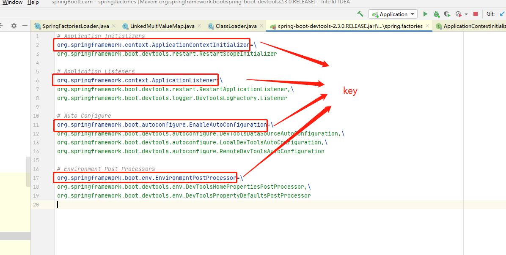
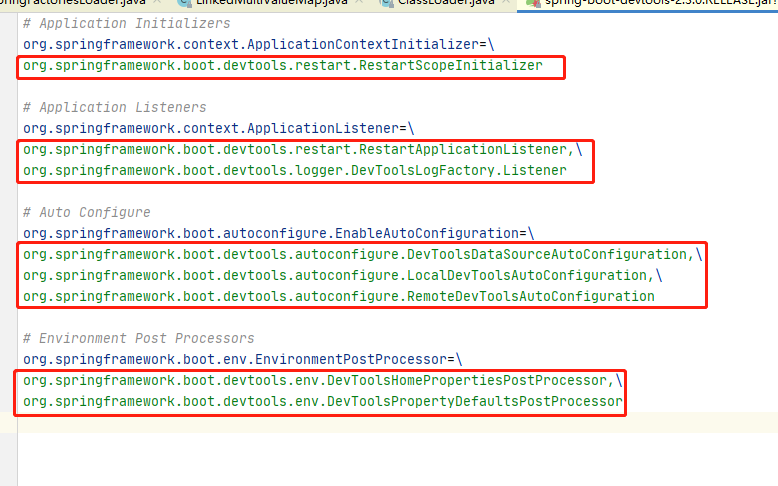
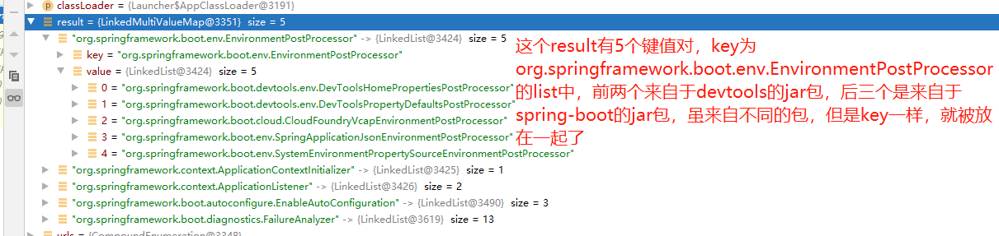

#源码分析（太难了）

## 1.应用启动
```java
@SpringBootApplication
public class Application {
        //springBoot应用启动
        SpringApplication.run(Application.class, args);
    }

}
```

探究一下run方法：

```java
//调用的是这个方法，接收了一个class类（用于接收配置类）
public static ConfigurableApplicationContext run(Class<?> primarySource, String... args) {
    return run(new Class[]{primarySource}, args);
}
//可接收多个class类，上面方法把单个class（Application.class）加到数组里调用这个方法
public static ConfigurableApplicationContext run(Class<?>[] primarySources, String[] args) {
    //正经的启动代码：先创建SpringApplication，再调用其run方法
    return (new SpringApplication(primarySources)).run(args);
}
```

那么，应用启动大概就分为两步：

1. 创建SpringApplication对象

2. run（）

一步一步看：
### 1.1创建SpringApplication对象

点进SpringApplication看看，调用了这个构造函数

```java
public SpringApplication(Class<?>... primarySources) {
   this(null, primarySources);
}
```

   这个构造函数又调用了另一个构造函数

```java
/**
	 * Create a new {@link SpringApplication} instance. The application context will load
	 * beans from the specified primary sources (see {@link SpringApplication class-level}
	 * documentation for details. The instance can be customized before calling
	 * {@link #run(String...)}.
	 * 创造一个新的SpringApplication实例，这个应用上下文将会从被指定的（传入的）primary sources加载bean。这个实例可以在调用run方法之前被自定义
	 * @param resourceLoader 要使用的资源加载程序
	 * @param primarySources 主要的Bean的源头
	 * @see #run(Class, String[])
	 * @see #setSources(Set)
	 */
public SpringApplication(ResourceLoader resourceLoader, Class<?>... primarySources) {
   this.resourceLoader = resourceLoader;
   Assert.notNull(primarySources, "PrimarySources must not be null");
   this.primarySources = new LinkedHashSet<>(Arrays.asList(primarySources));
   this.webApplicationType = WebApplicationType.deduceFromClasspath();
   setInitializers((Collection) getSpringFactoriesInstances(ApplicationContextInitializer.class));
   setListeners((Collection) getSpringFactoriesInstances(ApplicationListener.class));
   this.mainApplicationClass = deduceMainApplicationClass();
}
```

   在执行这个构造方法前会给SpringApplication的许多成员变量赋上默认值，可能所有的对象创建都是这样子吧，new的时候先给成员变量赋值，然后执行构造器中的代码，下面来仔细分析这个构造器：

```java
public SpringApplication(ResourceLoader resourceLoader, Class<?>... primarySources) {
   this.resourceLoader = resourceLoader;//将resourceLoader保存到成员变量
    //知识点1：Assert.notNull（）：断言语句，判断对象是否为空，是的话抛出异常，异常的message为传入的第二个参数；不是就继续执行
   Assert.notNull(primarySources, "PrimarySources must not be null");//判断primarySources是否为空
    //HashSet不保证顺序，LinkedHashSet保证顺序（遍历序和插入序是一致的）
    //先将primarySources数组转化为ArrayList,然后再传入LinkedHashSet转成set去重
   this.primarySources = new LinkedHashSet<>(Arrays.asList(primarySources));//将primarySources保存到成员变量
   this.webApplicationType = WebApplicationType.deduceFromClasspath();//判断一下当前应用是不是web应用
    //知识点2：
   setInitializers((Collection) getSpringFactoriesInstances(ApplicationContextInitializer.class));
    //同知识点2
   setListeners((Collection) getSpringFactoriesInstances(ApplicationListener.class));
    //从多个primarySources（配置类）中找到主配置类
   this.mainApplicationClass = deduceMainApplicationClass();
}
```

#### 知识点1详解：

#####  assert 断言关键字（不建议使用，看懂就行）

​		assert关键字语法很简单，有两种用法：

​    1、assert <boolean表达式>

​    如果<boolean表达式>为true，则程序继续执行。

​    如果为false，则程序抛出AssertionError，并终止执行。

  例如：assert true;

​    2、assert <boolean表达式> : <错误信息表达式>

​    如果<boolean表达式>为true，则程序继续执行。

​    如果为false，则程序抛出java.lang.AssertionError，并输入<错误信息表达式>。

例如：assert false : "断言失败，此表达式的信息将会在抛出异常的时候输出！";

**注意：应当避免在Java中使用assert关键字**

1、 assert关键字需要在运行时候显式开启才能生效，否则你的断言就没有任何意义。而现在主流的Java IDE工具默认都没有开启-ea断言检查功能。这就意味着你如果使用IDE工具编码，调试运行时候会有一定的麻烦。并且，对于Java Web应用，程序代码都是部署在容器里面，你没法直接去控制程序的运行，如果一定要开启-ea的开关，则需要更改Web容器的运行配置参数。这对程序的移 植和部署都带来很大的不便。

 

   2、用assert代替if是陷阱之二。assert的判断和if语句差不多，但两者的作用有着本质的区别：assert关键字本意上是为测试 调试程序时使用的，但如果不小心用assert来控制了程序的业务流程，那在测试调试结束后去掉assert关键字就意味着修改了程序的正常的逻辑。

 

   3、assert断言失败将面临程序的退出。这在一个生产环境下的应用是绝不能容忍的。一般都是通过异常处理来解决程序中潜在的错误。但是使用断言就很危险，一旦失败系统就挂了。

```java

public static void notNull(@Nullable Object object, String message) {
		if (object == null) {
			throw new IllegalArgumentException(message);
		}
	}
```


#### 知识点2详解：

点进setInitializers（）方法看看，其实就是给当前对象的initializers赋值

```java
源：
setInitializers((Collection) getSpringFactoriesInstances(ApplicationContextInitializer.class));
//只接收Collection，而且泛型还必须是ApplicationContextInitializer的子类。
public void setInitializers(Collection<? extends ApplicationContextInitializer<?>> initializers) {
   this.initializers = new ArrayList<>(initializers);
}
```

   再来看看要给setInitializers（）传的参数，getSpringFactoriesInstances(ApplicationContextInitializer.class)

```java
/*
*getSpringFactoriesInstances直译：获取springFactories中的实例
*
*返回一个Collection<T>，就是initializers吧
*
*/
private <T> Collection<T> getSpringFactoriesInstances(Class<T> type, Class<?>[] parameterTypes, Object... args) {
    //获取类加载器
   ClassLoader classLoader = getClassLoader();
   //知识点2.1看完后，就知道new LinkedHashSet<>()中传入了一个list，里面全是ApplicationContextInitializer下的Bean的全类名
   // Use names and ensure unique to protect against duplicates
    //转成set是因为要去重
   Set<String> names = new LinkedHashSet<>(SpringFactoriesLoader.loadFactoryNames(type, classLoader));
    //字面意思，创建springFactories的实例，就是把刚得到的名称实例化
   List<T> instances = createSpringFactoriesInstances(type, parameterTypes, classLoader, args, names);
    //给list排序
   AnnotationAwareOrderComparator.sort(instances);
    //返回这些实例
   return instances;
}
```

##### 	知识点2.1：

又见面了。（03_自动配置原理）看看SpringFactoriesLoader.loadFactoryNames（）方法是干啥的

```java
源：
    //这里type就是ApplicationContextInitializer.class
    Set<String> names = new LinkedHashSet<>(SpringFactoriesLoader.loadFactoryNames(type, classLoader));
	
/**
 * Load the fully qualified class names of factory implementations of the
 * given type from {@value #FACTORIES_RESOURCE_LOCATION}, using the given
 * class loader.
 *	根据全限定类名，用给定的class loader加载"META-INF/spring.factories"下的factory的实现，
 *	就是说用类加载器加载META-INF/spring.factories中的那些全类名
 * @param factoryType the interface or abstract class representing the factory
 *	表示工厂的实现类或者抽象类
 * @param classLoader the ClassLoader to use for loading resources; can be
 * {@code null} to use the default
 *	类加载器
 * @throws IllegalArgumentException if an error occurs while loading factory names
 * @see #loadFactories
 */
public static List<String> loadFactoryNames(Class<?> factoryType, @Nullable ClassLoader classLoader) {
   String factoryTypeName = factoryType.getName();//获取到ApplicationContextInitializer的全限定类名
   return loadSpringFactories(classLoader).getOrDefault(factoryTypeName, Collections.emptyList());// loadSpringFactories会返回一个map，getOrDefault方法是用这个传入的factoryType的全限定类名，作为key去找出那个相应的list
}
```

说一下loadSpringFactories这个方法吧，这方法是真的吊：

```java
//cache是个map，key是ClassLoader，value是个map
private static final Map<ClassLoader, MultiValueMap<String, String>> cache = new ConcurrentReferenceHashMap<>();
//字面意思：加载所有的springFactories
private static Map<String, List<String>> loadSpringFactories(@Nullable ClassLoader classLoader) {
    //先用传进来的ClassLoader看看能不能找到value，找到说明之前加载过了，直接return
   MultiValueMap<String, String> result = cache.get(classLoader);
   if (result != null) {
      return result;
   }

   try {
       //扫描所有jar包中的"META-INF下的spring.factories"
      Enumeration<URL> urls = (classLoader != null ?
            classLoader.getResources(FACTORIES_RESOURCE_LOCATION) :
            ClassLoader.getSystemResources(FACTORIES_RESOURCE_LOCATION));
      //新建一个结果集，一会用来当cache的value
       result = new LinkedMultiValueMap<>();
       //一个jar包一个jar包过，把所有spring.factories中的bean名字放入结果集
      while (urls.hasMoreElements()) {
         URL url = urls.nextElement();
         UrlResource resource = new UrlResource(url);
         Properties properties = PropertiesLoaderUtils.loadProperties(resource);
         for (Map.Entry<?, ?> entry : properties.entrySet()) {
            String factoryTypeName = ((String) entry.getKey()).trim();
            for (String factoryImplementationName : StringUtils.commaDelimitedListToStringArray((String) entry.getValue())) {
               result.add(factoryTypeName, factoryImplementationName.trim());
            }
         }
      }
       //将结果集作为value，classLoader作为key存入cache中
      cache.put(classLoader, result);
       //返回结果集
      return result;
   }
   catch (IOException ex) {
      throw new IllegalArgumentException("Unable to load factories from location [" +
            FACTORIES_RESOURCE_LOCATION + "]", ex);
   }
}
```

来详细看一看cache和result

cache就是个map：

key是classLoader，value是result

result是个map：

key就是



value是个LinkedList

LinkedList中就是这些bean的名字



然后一个一个jar包一个jar包过，把所有spring.factories中的bean名字放入result：

不同的jar包肯定有重复的key，比如org.springframework.context.ApplicationContextInitializer，org.springframework.boot.autoconfigure.EnableAutoConfiguration，几乎每个spring.factories都有，它们中的bean就被放在同一个LinkedList中。



最后，result就有了所有jar中的spring.factories中的bean名字，而且还是用key分成好几种的

### 1.2 run方法

```java
/**
 * Run the Spring application, creating and refreshing a new
 * {@link ApplicationContext}.
 * @param args the application arguments (usually passed from a Java main method)
 * @return a running {@link ApplicationContext}
 */
public ConfigurableApplicationContext run(String... args) {
   StopWatch stopWatch = new StopWatch();
   stopWatch.start();
   ConfigurableApplicationContext context = null;
   Collection<SpringBootExceptionReporter> exceptionReporters = new ArrayList<>();
   configureHeadlessProperty();
    
   SpringApplicationRunListeners listeners = getRunListeners(args);
   listeners.starting();
   try {
      ApplicationArguments applicationArguments = new DefaultApplicationArguments(args);
      ConfigurableEnvironment environment = prepareEnvironment(listeners, applicationArguments);
      configureIgnoreBeanInfo(environment);
      Banner printedBanner = printBanner(environment);
      context = createApplicationContext();
      exceptionReporters = getSpringFactoriesInstances(SpringBootExceptionReporter.class,
            new Class[] { ConfigurableApplicationContext.class }, context);
      prepareContext(context, environment, listeners, applicationArguments, printedBanner);
      refreshContext(context);
      afterRefresh(context, applicationArguments);
      stopWatch.stop();
      if (this.logStartupInfo) {
         new StartupInfoLogger(this.mainApplicationClass).logStarted(getApplicationLog(), stopWatch);
      }
      listeners.started(context);
      callRunners(context, applicationArguments);
   }
   catch (Throwable ex) {
      handleRunFailure(context, ex, exceptionReporters, listeners);
      throw new IllegalStateException(ex);
   }

   try {
      listeners.running(context);
   }
   catch (Throwable ex) {
      handleRunFailure(context, ex, exceptionReporters, null);
      throw new IllegalStateException(ex);
   }
   return context;
}
```