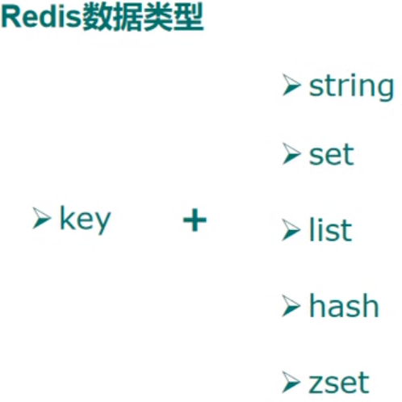
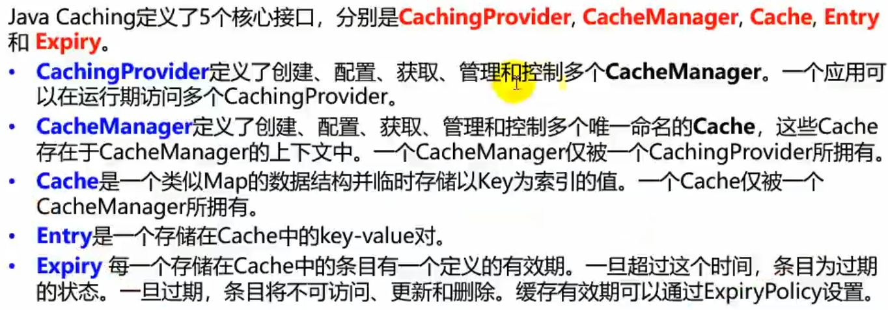
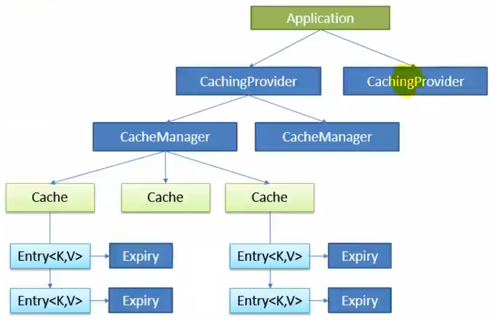
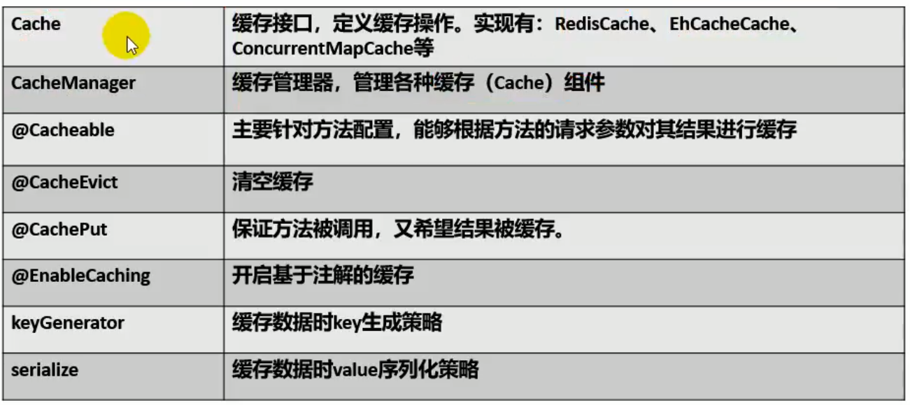

**适用于 07_redis_SecKill和09_redis_template**

# Redis笔记

## 1.数据类型



其实都是键值对的形式（key-value），只不过这个值可以是以上五种类型的：

- #### String：字符串

- #### set：

  底层是一个value为null的hash表（map），所以他是无序且无重复的。

- #### list：

  底层是双向链表，两端操作性强，中间操作性差；可以通过下标取数据	

- #### hash:

  相当于java中的Map<String,String>

- #### zset:

  无重复且有序的一个set，底层是一个key为vlaue，value为score的hash（Map），所以它无重复（map中key不能重复呀），且有序（用score的大小进行排序，score可以重复）

  **其实redis没啥讲的，主要就是那些指令，还有就是配置文件中的参数、主从复制、持久化、集群这些。
  
  ## 2.缓存
  
  ###  2.1缓存的框架结构
  
  
  
  它们之间的关系如下图：
  
   

应用程序直接访问Caching Provider（缓存提供者），每一个缓存提供者又管理了多个CatcheManager(缓存管理器)，缓存管理器才真正管理了多个缓存（就相当于一次操作，理解为关系型数据库中的一条sql）。

### 2.2 Spring缓存抽象

spring将上面的框架结构给简化了，只留下CacheManager和Cache两个概念，还有一些注解被沿用下来：



**要使用以上的注解，需要以下两步：**

1. 在启动类上加上@EnableCaching标签
2. 在具体缓存方法上使用以上标签即可

接下来来看看@Cacheable这个标签（用在方法上），他有一些参数：

```java
public @interface Cacheable {
    //指定缓存组件的名字
    @AliasFor("cacheNames")
    String[] value() default {};
	
    @AliasFor("value")
    String[] cacheNames() default {};
	//缓存数据使用的key的编写规则，可用spEl来写，系统会默认使用一个叫keyGenerator的组件来生成key
    String key() default "";
	//指定keyGenerator，这样就可以指定自己写的keyGenerator，并自己制定key的生成规则，和上面的key方法差不多
    String keyGenerator() default "";

    String cacheManager() default "";

    String cacheResolver() default "";
	//符合指定条件（用spEL编写）的值才缓存，例如：
    //condition = "#a0>1"	方法第一个参数必须大于一才缓存
    String condition() default "";
	//符合指定条件（用spEL编写）的值就不缓存，它可以判断结果，例如：unless = "#result==null"	方法的返回值如果是空则不缓存
    String unless() default "";

    boolean sync() default false;
}
```

@CachePut：既调用方法也更新缓存。

@CacheEvict：删除缓存，用在删除方法上，通过key指定要删除的缓存

### 2.3 SpringBoot使用redis

1.引入redis依赖

2.引入后springBoot会自动注册两个组件：

- StringRedisTemplate：用来操作k-v都是字符串的
- RedisTemplate：用来操作k-v都是对象的

3.拿来用即可。例如：

```java
@SpringBootTest
class RedisTemplateApplicationTests {
    @Autowired
    RedisTemplate redisTemplate;
    @Autowired
    StringRedisTemplate stringRedisTemplate;
    @Autowired
    empMapper empMapper;
    @Autowired
    empService empService;
    @Test
    void test1() {
        /*
        五种数据类型对应五个方法:opsFor****().
         */
//        stringRedisTemplate.opsForValue().append("k1","v1");
//        String k1 = stringRedisTemplate.opsForValue().get("k1");
//        System.out.println(k1);

        //操作list
        stringRedisTemplate.opsForList().leftPush("mylist","张三");
        stringRedisTemplate.opsForList().leftPush("mylist","李四");
        String mylist1 = stringRedisTemplate.opsForList().rightPop("mylist");

    }
    @Test
    public void test2(){
        Employee emp = empMapper.getEmpById(1);
        System.out.println(emp);
        //将这个对象存入redis时需要把对象序列化，所以这个对象必须实现Serializable。
        redisTemplate.opsForValue().set("emp-01",emp);
        //默认使用jdk自带的序列化器进行序列化的，所以在redis中看不懂，但是取出来照样能用。如需按照json格式序列化，那就自己写个redisTemplate，把序列化器换成json的即可
        Employee emp01 = (Employee)redisTemplate.opsForValue().get("emp-01");
        System.out.println(emp01);
    }
}
```

### 2.4用缓存标签操作redis

这样更简单方便（相比较StringRedisTemplate和RedisTemplate），你只要引入的redis依赖，再按正常使用缓存标签，它自动就会给你使用redis进行缓存。

```java
@Service
public class empService {
@Autowired
private empMapper empMapper;
@Autowired
private RedisCacheManager cacheManager;

    /**
     * 方式一：使用注解的方式进行缓存（记得要使用标签需要在启动类上加@EnableCaching标签）
     * @param id
     * @return
     */
    @Cacheable("emp")
    public Employee getEmpById(int id){
     Employee emp= empMapper.getEmpById(id);
        System.out.println(emp);
        return  emp  ;
    }

    /**
     * 方式二：自己写代码进行缓存（二者效果一样）
     * @param id
     * @return
     */
    public Employee getEmpById2(int id){
        Employee emp= empMapper.getEmpById(id);
        System.out.println(emp);
        //1.用cacheManager获取cache
        Cache cache = cacheManager.getCache("emp");
        //2.用cache对象操作缓存
        cache.put(id,emp);
        return  emp  ;
    }
}
```

