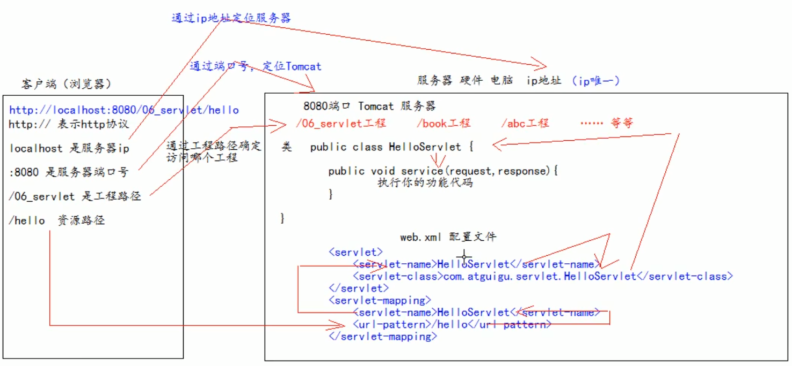
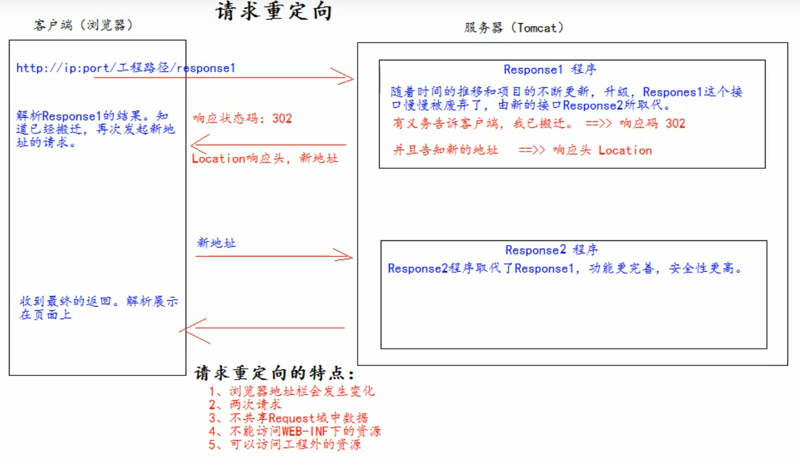

**适用于 08_SB_Servlet**

## 一、Servlet

Servlet是运行在服务器上得一个java小程序，它可以接收客户端发送过来的请求，并响应数据给客户端

### Servlet的四个作用域对象（一个不常用）

1. ServletContext（应用级别，一整个应用就一个这个对象）
2. session（同一个用户使用同一个浏览器，在浏览器打开到关闭时公用一个）
3. page（页面级别，不常用）
4. request（一次请求）


这些对象都可以通过上图中的方法去操作其属性：


### ServletContext

1. Servlet是一个接口，它表示Servlet上下文对象
2. 一个web工程，只有一个Servlet Context实例
3. Servlet对象是一个域对象
4. Servlet Context是在web工程部署启动的时候创建的。

什么是域对象？

域对象，是可以像Map一样存取数据的对象，叫域对象。这里的域指的是存取数据的操作范围。

|        | 存数据         | 取数据         | 删除数据          |
| ------ | -------------- | -------------- | ----------------- |
| Map    | put()          | get()          | remove()          |
| 域对象 | setAttribute() | getAttribute() | removeAttribute() |

### ServletContext作用

1. 获取上下文参数（web.xml中写的&lt;context-param&gt;标签中的数据）
2. 获取当前的工程路径。（.getContextPath()方法）
3. 获取工程部署后在服务器硬盘上的绝对路径。（.getRealPath()方法）
4. 可以像map一样存取数据

### Servlet三大组件

- Servlet
- Listener
- Filter

### Servlet程序创建

1. Servlet就是个接口，谁实现它谁就是Servlet程序。

2. 实现Servlet接口的Service方法，里面写你的程序就行了。但是，一般开发都是通过继承HttpServlet来实现的，用重写doGet和doPost来实现业务代码。
3. 在web.xml中配置Servlet。

### 地址如何找到Servlet程序



### 重定向本质

假定浏览器第一次请求一个Servlet，被这个Servlet重定向到第二个Servlet，那么，第一个Servlet响应的时候要做的事情分为两步：

1.响应状态设置为302。（302就是重定向）

2.响应头中的Location设置为新地址。


虽然spring把它封装起来了，但是本质就是这两步。

写一下Servlet1的实现代码：

```java
//方法一 
resp.setStatus(302);
resp.setHeader("Location","http://www.baidu.com");
//方法二
resp.sendRedirect("http://www.baidu.com");
```

下方是流程图




## 二、Servlet Listener（监听器）

三个Servlet对象都有其相对应的监听器，可分为两种

#### 1.监听三大域对象的创建与销毁

- 监听Application对象：ServletContext Listener（用例：启动时可使用这个监听器往内存里加一些静态变量）
- 监听Session对象：HttpSession Listener（用例：统计在线人数）
- 监听Request对象：ServlertRequest Listener（用例：监听访问量）

#### 2.监听域对象内属性的变化

- HttpSessionAttributeListener
- ServletContextAttributeListener
- ServletRequestAttributeListener

#### 3.Listener使用方法

- 要用上面这些Listener，自己写个实现类，实现上面的接口，并重写人家的方法就行了，记得要注册。

#### 4.Listener注册方法

- 使用@WebListener注解（方便，推荐）
- ServletListenerFilterRegistrationBean（SpringBoot给Servlet三大组件都提供了相对应的RegistrationBean）
- web.xml中配置（老web项目）

## 三、过滤器

过滤器通常用于对访问Ip的识别呀，加密请求的解密呀，敏感词检测呀什么的。

- 在客户端发的请求访问后端资源之前，拦截这些请求
- 在服务器的响应发送回客户端之前，处理这些响应


#### 1.详细说明：


#### 2.具体使用例子如下：

​	写个Filter实现类就行了，记得要注册。

```java
package com.ljj.servlet.Filter;


import javax.servlet.*;
import javax.servlet.annotation.WebFilter;
import java.io.IOException;

/**
 * @WebFilter(filterName = "filter1",urlPatterns = "/*") 用于将本对象实例化并加入到Ioc容器中去（需要配合@ServletComponentScan使用）
 *                                                       这样子确实方便，但是无法保证过滤器链的执行顺序。
 */
@WebFilter(filterName = "filter1",urlPatterns = "/*")
public class myFilter1 implements Filter {
    /**
     *  初始化Filter时调用
     *  Web 容器创建 Filter 的实例对象后，将立即调用该 Filter 对象的 init 方法。init 方法在 Filter 生命周期中仅被执行一次。
     * @param filterConfig  包含 Filter 的配置和运行环境信息的 FilterConfig 对象
     * @throws ServletException
     */
    @Override
    public void init(FilterConfig filterConfig) throws ServletException {
        System.out.println("Filter1 被加载了。。。。。。。。。。。。。");
        System.out.println(filterConfig);
    }

    /**
     *
     * 当一个 Filter 对象能够拦截访问请求时，Servlet 容器将调用 Filter 对象的 doFilter 方法。
     * @param servletRequest 就是此次客户端发过来的请求
     * @param servletResponse 服务端返回去的响应
     * @param filterChain 过滤器链对象
     * @throws IOException
     * @throws ServletException
     *
     */
    @Override
    public void doFilter(ServletRequest servletRequest, ServletResponse servletResponse, FilterChain filterChain) throws IOException, ServletException {
            servletRequest.setCharacterEncoding("UTF-8");
            System.out.println("+++++++++++++++++++++Filter1执行前前前前++++++++++++++++++++++++++");
            filterChain.doFilter(servletRequest,servletResponse);//使用这个方法，如果有别的过滤器也要应用就会继续调用那个过滤器的doFilter方法，如果没有别的过滤器，就会执行目标 Servlet 的 service 方法
            servletResponse.setCharacterEncoding("UTF-8");
            System.out.println("+++++++++++++++++++++Filter1执行后后后后后++++++++++++++++++++++++++");

    }

    /**
     * 该方法在 Web 容器卸载 Filter 对象之前被调用，也仅执行一次。可以完成与 init 方法相反的功能，释放被该 Filter 对象打开的资源，例如：关闭数据库连接和 IO 流。
     */
    @Override
    public void destroy() {
        System.out.println("Filter1 被销毁了。。。。。。。。。。。。。");
    }
}
```

#### 3.filter注册spring方法：

- 利用@WebFilter注解（方便，但无法控制执行顺序）
- FilterRegistrationBean方式（推荐）
- XML配置方式（旧方式，spring用）