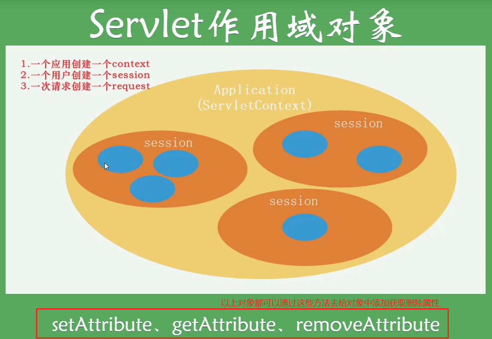
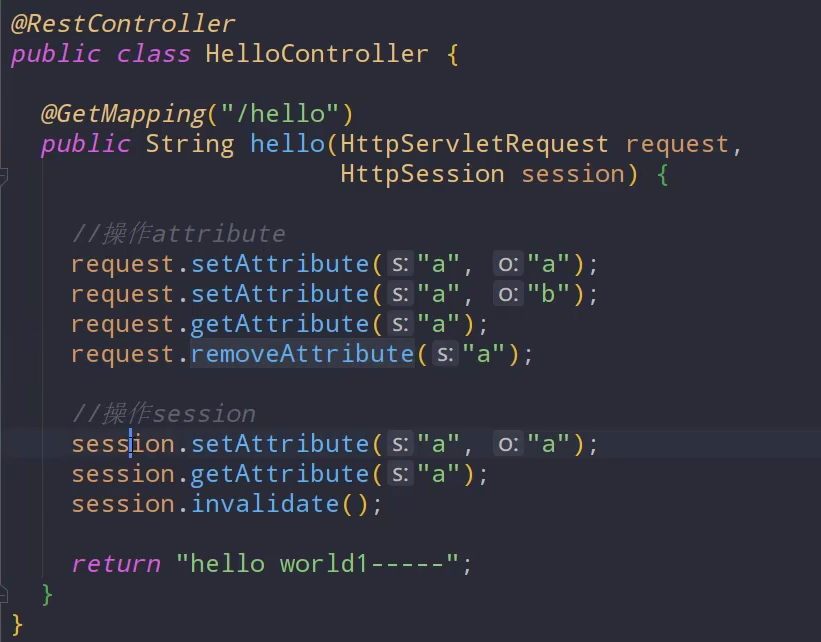

## 一、Servlet

### Servlet的四个作用域对象（一个不常用）

1. ServletContext（应用级别，一整个应用就一个这个对象）
2. session（同一个用户使用同一个浏览器，在浏览器打开到关闭时公用一个）
3. page（页面级别，不常用）
4. request（一次请求）

这些对象都可以通过上图中的方法去操作其属性：

## 二、Servlet Listener（监听器）

三个Servlet对象都有其相对应的监听器，可分为两种

#### 1.监听三大域对象的创建与销毁

- ServletContext Listener（用例：启动时可使用这个监听器往内存里加一些静态变量）
- HttpSession Listener（用例：统计在线人数）
- ServlertRequest Listener（用例：监听访问量）

#### 2.监听域对象内属性的变化

- HttpSessionAttributeListener
- ServletContextAttributeListener
- ServletRequestAttributeListener