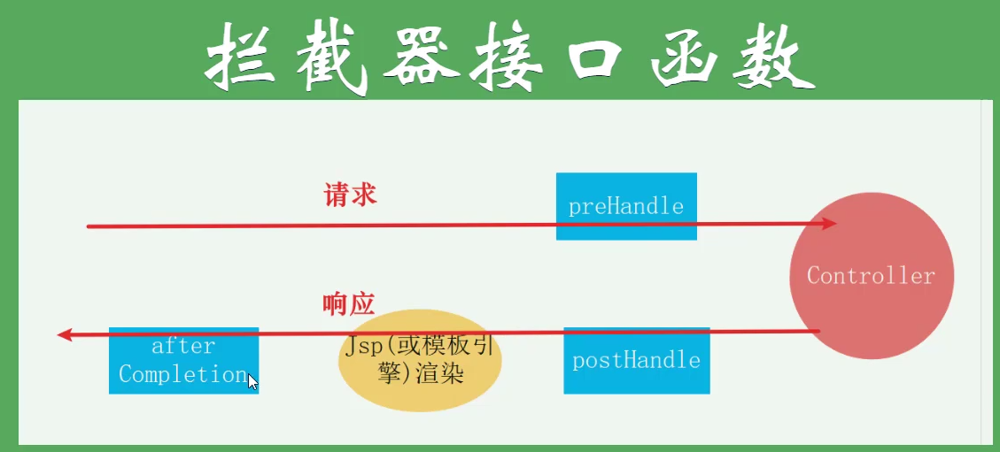
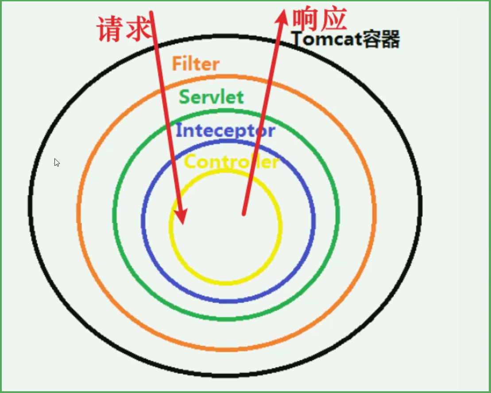
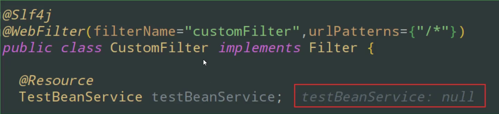
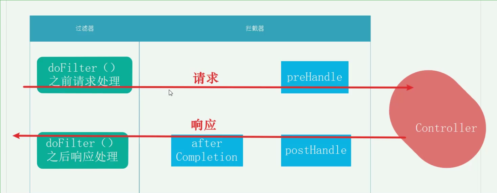

**适用于 08_SB_Servlet**

## 拦截器

拦截器并不是Servlet中的概念，而是Spring中的概念。

### 一、拦截器中的方法

- preHandle
- postHandle
- afterCompletion

### 二、各方法执行时机和顺序



### 三、和过滤器的异同

拦截器和过滤器的作用类似，过滤器能做的拦截器几乎都能做

区别：

- 规范不同：过滤器在Servlet中生效，拦截器在Spring上下文中生效
- 作用范围不同：Filter作用范围更大一些



- 使用资源不同：拦截器可以获取spring 的ioc容器中的bean，而过滤器就不行；如下图，你自动注入就注入不进去



- 粒度不同：由于Filter范围更大，所以比较适合那种全局的api的处理，比如

权限的验证；interceptor则更适合一些分模块，分业务的请求的处理。

### 四、拦截器的使用

​	使用方法很简单，自己写一个HandlerInterceptor的实现类，实现人家的三个方法就完事了。然后使用WebMvcConfigurer的实现类注册将自己写的这些实现类通过addInterceptors方法中的registry.addInterceptor(myInterceptor1).addPathPatterns("/*");加入进去就行了。具体代码实现见下方：

- 自定义的拦截器

```java
@Slf4j
@Component
    public class MyInterceptor1 implements HandlerInterceptor {
    @Override
    public boolean preHandle(HttpServletRequest request, HttpServletResponse response, Object handler) throws Exception {
        log.warn("MyInterceptor1的preHandle执行啦（请求前调用）！！！！！！！！！！！！！！！！");
        //返回false则请求中断
        return true;
    }

    @Override
    public void postHandle(HttpServletRequest request, HttpServletResponse response, Object handler, ModelAndView modelAndView) throws Exception {
        log.warn("MyInterceptor1的postHandle执行啦（请求后调用）！！！！！！！！！！！！！！！！");
    }

    @Override
    public void afterCompletion(HttpServletRequest request, HttpServletResponse response, Object handler, Exception ex) throws Exception {
        log.warn("MyInterceptor1的afterCompletion执行啦（请求调用完成后回调方法，即在视图渲染完成后回调）！！！！！！！！！！！！！！！！");

    }
}
```

- 注册拦截器

```java
//WebMvcConfigurer就是springBoot对springMVC配置的封装，你自己写的那些组件就可以用这个类去往springMVC中添加
//@EnableWebMvc 加上这个标签就全面接管springMVC了，并不是指添加这些组件，而是只用这些组件。
@Configuration
public class myWebMvcConfigurer implements WebMvcConfigurer {
    @Autowired
    MyInterceptor1 myInterceptor1;
    @Autowired
    MyInterceptor2 myInterceptor2;

    @Override
    public void addInterceptors(InterceptorRegistry registry) {
        //注册拦截器 并写拦截规则
        registry.addInterceptor(myInterceptor1).addPathPatterns("/*");
        //多个拦截器时按照注册顺序去执行拦截器
        registry.addInterceptor(myInterceptor2).addPathPatterns("/users");
    }
}
```

### 五、拦截器和过滤器的执行顺序

先执行过滤器，再执行拦截器，同样遵循请求时先执行的拦截器在响应时后执行的原则



